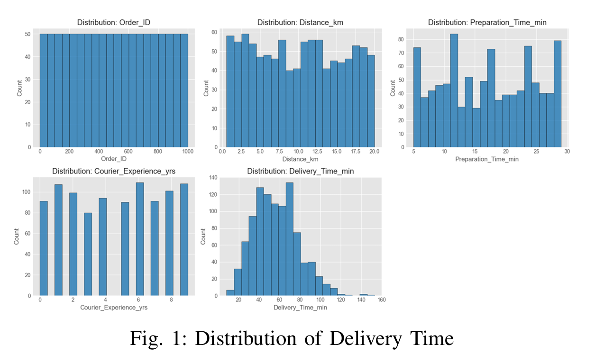
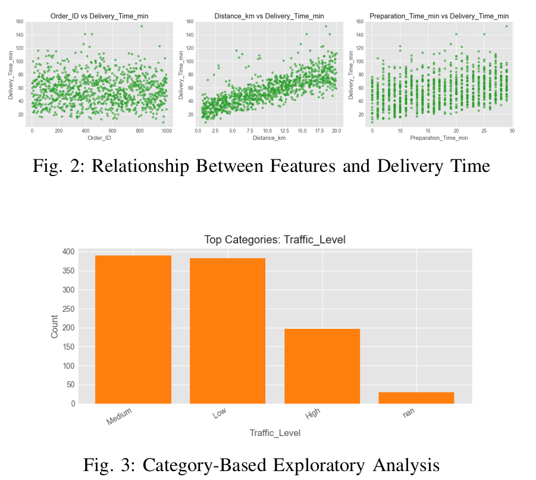
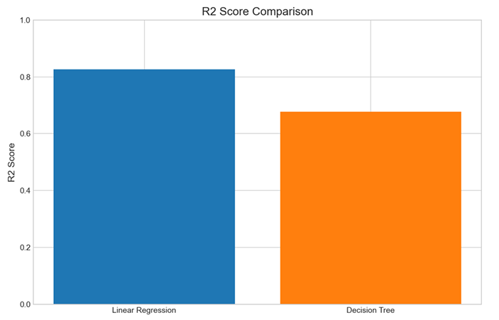
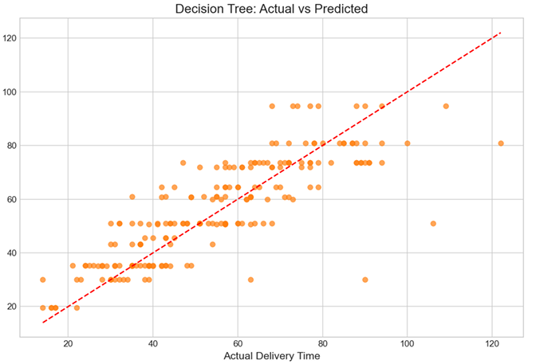

# Delivery Time Estimation using Comparative Regression Analysis

Machine Learning pipeline for estimating food delivery duration using operational and environmental features.

---

## Project Highlights

* The dataset was repeatedly shuffled and split into training and testing sets to ensure stable and reliable performance rather than relying on a single split.
* Multiple regression algorithms were initially explored, and after extensive experimentation, **Linear Regression** and **Decision Tree Regression** emerged as the two strongest candidates for detailed evaluation.
* The final system was built around these models and selected the best-performing approach based on multiple evaluation metrics and cross-validation.

---

#### Preprocessing and Modelling Pipeline


---

## Problem Statement

Accurate delivery time estimation is essential for improving customer experience and optimizing delivery operations.

This project predicts food delivery duration using factors such as:

* Distance travelled
* Weather conditions
* Traffic level
* Time of day
* Vehicle type
* Preparation time
* Courier experience

The objective was not only to maximize prediction accuracy but also to understand **which operational factors contribute most to delivery delays**.

---

# Workflow Overview

```text
Raw Dataset
      ↓
Exploratory Data Analysis
      ↓
Data Cleaning & Preprocessing
      ↓
Feature Engineering
      ↓
Model Experimentation
      ↓
Model Comparison
      ↓
Cross Validation
      ↓
Explainability Analysis
      ↓
Final Prediction Pipeline
```

---

# Dataset Overview

The dataset contains delivery-related operational variables and a target variable:

### Target Variable

* Delivery_Time_min

### Input Features

* Distance_km
* Weather
* Traffic_Level
* Time_of_Day
* Vehicle_Type
* Preparation_Time_min
* Courier_Experience_yrs

---

## Exploratory Data Analysis

EDA was performed to understand:

* feature distributions,
* relationships with delivery time,
* category frequencies,
* possible trends and anomalies.

### Delivery Time Distribution





### Relationship Between Features and Delivery Time





### Correlation Analysis


---

# Data Preprocessing

The preprocessing pipeline included:

* removal of empty rows and columns,
* handling missing values,
* median imputation for numerical variables,
* mode imputation for categorical variables,
* one-hot encoding,
* identifier removal (`Order_ID`),
* train-test splitting.

### Preprocessing Pipeline


---

# Model Experimentation

Several regression approaches were explored during experimentation.

After multiple trials, the following two models consistently produced the best results:

### Linear Regression

Simple, interpretable and computationally efficient.

### Decision Tree Regressor

Capable of capturing nonlinear relationships and feature interactions.

---

# Model Training Strategy

Instead of relying on a single train-test split, the dataset was repeatedly randomized and evaluated to reduce split bias and improve reliability.

Additionally, five-fold cross-validation was used to measure model stability.

---

# Performance Comparison

| Model             |   MAE |   RMSE |    MAPE | R² Score |
| ----------------- | ----: | -----: | ------: | -------: |
| Linear Regression | 5.899 |  8.826 | 10.407% |    0.826 |
| Decision Tree     | 8.774 | 12.032 | 17.532% |    0.677 |

Linear Regression consistently outperformed Decision Tree across all major evaluation metrics.

---

## Model Comparison Dashboard


 error_matrix_comparison.png




---

# Actual vs Predicted Results


.png)





---

# Cross Validation Results

| Model             | Mean CV MAE |
| ----------------- | ----------: |
| Linear Regression |       6.548 |
| Decision Tree     |       9.223 |

Cross-validation further confirmed that Linear Regression generalized better and produced more stable predictions.

---

# Explainability Analysis

Beyond prediction accuracy, the project focused on understanding the factors driving delivery delays.

The strongest contributors were:

* Distance travelled
* Traffic level
* Weather conditions
* Preparation time

# Key Findings

* Linear Regression outperformed Decision Tree on all evaluation metrics.
* Identifier columns negatively affected model quality.
* Delivery distance and traffic conditions were the strongest delay drivers.
* Simpler interpretable models performed better than more complex alternatives for this dataset.

---

# Technologies Used

Python • Pandas • NumPy • Scikit-Learn • Matplotlib • Google Colab

---

# Future Improvements

* Random Forest and Gradient Boosting models
* Real-time API integration
* Web dashboard for live prediction
* Route optimization features

---

## Repository Structure

```text
├── notebook.ipynb
├── dataset.csv
├── requirements.txt
├── README.md
├── images/
├── model.pkl
└── model_info.json
```
