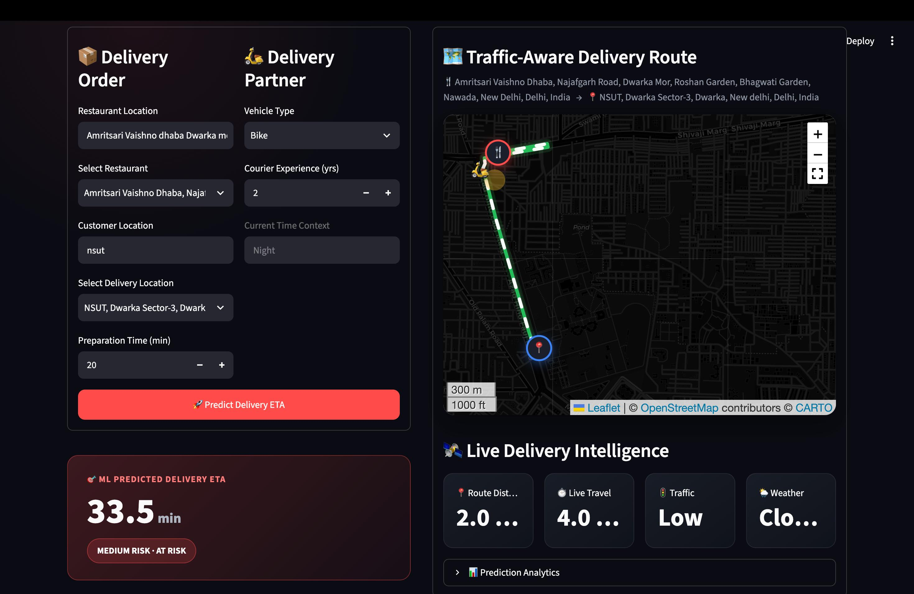
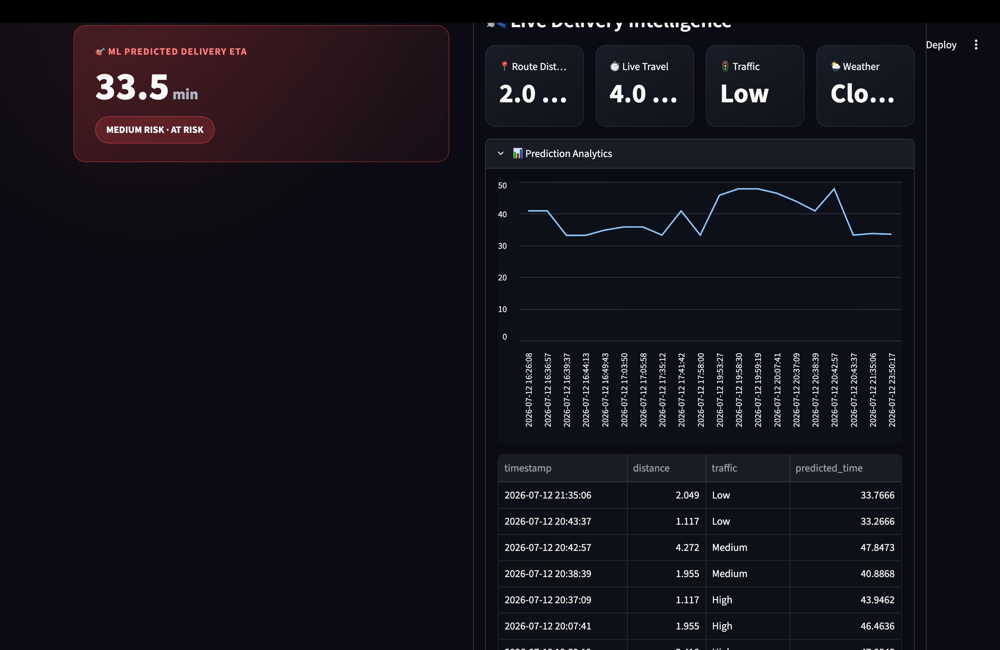

# 🍔 Delivery Intelligence Dashboard

An ML-powered delivery time prediction system with **real-time traffic routing**, **live weather integration**, and an interactive **Streamlit dashboard**.

---

## 🎬 Demo


> Run locally with `streamlit run app.py`

---

## Application Screenshots

### Dashboard — Prediction & Route Map



> Delivery from **Amritsari Vaishno Dhaba** to **NSUT, Dwarka** with predicted ETA of **33.5 min** (Medium Risk), along with the animated traffic-aware route on a dark-themed map.

### Dashboard — Prediction Analytics



> Expanded **Prediction Analytics** section showing historical ETA trends and a detailed prediction history table.

---

## How It Works

```
┌──────────────────────────────────────────────────────────────────┐
│                        USER INPUT                                │
│  Restaurant Location · Customer Location · Vehicle · Experience  │
└──────────────────────┬───────────────────────────────────────────┘
                       │
                       ▼
         ┌─────────────────────────┐
         │  Google Places API      │
         │  Autocomplete + Coords  │
         └────────────┬────────────┘
                      │
          ┌───────────┴───────────┐
          ▼                       ▼
┌──────────────────┐   ┌──────────────────┐
│ Google Routes API│   │ OpenWeatherMap   │
│ Distance, ETA,   │   │ API              │
│ Live Traffic,    │   │ Weather at       │
│ Route Polyline   │   │ destination      │
└────────┬─────────┘   └────────┬─────────┘
         │                      │
         ▼                      ▼
┌──────────────────────────────────────────┐
│         TRAFFIC CALCULATION              │
│  live_time / static_time ratio:          │
│  < 1.15 → Low    │ 1.15-1.35 → Medium   │
│  1.35-1.60 → High│ > 1.60 → Very High   │
└──────────────────┬───────────────────────┘
                   │
                   ▼
┌──────────────────────────────────────────┐
│         FEATURE VECTOR (7 features)      │
│  Distance_km · Weather · Traffic_Level   │
│  Time_of_Day · Vehicle_Type              │
│  Preparation_Time_min                    │
│  Courier_Experience_yrs                  │
└──────────────────┬───────────────────────┘
                   │
                   ▼
┌──────────────────────────────────────────┐
│    🤖 LINEAR REGRESSION MODEL            │
│    model.predict(features)               │
└──────────────────┬───────────────────────┘
                   │
                   ▼
┌──────────────────────────────────────────┐
│         RISK CLASSIFICATION              │
│  ≤ 30 min  → ✅ LOW (ON TIME)            │
│  31-45 min → ⚠️ MEDIUM (AT RISK)        │
│  > 45 min  → 🚨 HIGH (DELAYED)          │
└──────────────────┬───────────────────────┘
                   │
        ┌──────────┼──────────┐
        ▼          ▼          ▼
   ┌─────────┐ ┌────────┐ ┌──────────┐
   │ ETA     │ │Animated│ │ Save to  │
   │ Card    │ │ Map    │ │ Database │
   └─────────┘ └────────┘ └──────────┘
```

---

## Features

| Feature | Description |
|---------|-------------|
| 🤖 **ML-Powered ETA** | Linear Regression model with R² = 0.82 |
| 🗺️ **Animated Route Map** | Folium map with AntPath animation and pulsing rider marker |
| 🚦 **Live Traffic** | Real-time traffic classification via Google Routes API |
| 🌦️ **Weather Integration** | Auto-detects weather at delivery location |
| 📍 **Place Autocomplete** | Google Places API with India region filtering |
| ⚠️ **Risk Classification** | LOW / MEDIUM / HIGH risk assessment |
| 📊 **Prediction Analytics** | Historical tracking with line charts |
| 🎨 **Dark Mode UI** | Premium dark theme with glassmorphism |
| 💾 **SQLite Persistence** | All predictions saved for analytics |

---

## Tech Stack

| Layer | Technology |
|-------|-----------|
| **Frontend** | Streamlit |
| **ML Model** | Scikit-Learn (Linear Regression) |
| **Maps** | Folium + streamlit-folium + AntPath |
| **Location API** | Google Places API + Google Routes API |
| **Weather API** | OpenWeatherMap |
| **Database** | SQLite3 |
| **Data Processing** | Pandas, NumPy |

---

## Project Structure

```
zomato/
├── app.py                    # Main Streamlit application
├── requirements.txt          # Python dependencies
├── .gitignore
├── README.md
│
├── model/
│   ├── model.pkl             # Trained scikit-learn pipeline
│   └── model_info.json       # Model metadata & metrics
│
├── notebooks/
│   ├── food_delivery_time_prediction.ipynb
│   └── food_delivery_time_pipeline.py
│
├── images/
│   ├── dashboard_prediction.jpeg
│   ├── dashboard_analytics.jpeg
│   └── demo_recording.mov
│
└── .streamlit/
    └── secrets.toml          # API keys
```

---

## Setup & Installation

### 1. Clone the Repository

```bash
git clone https://github.com/techbhuvi04/Deilvery-Time-Pediction.git
cd Deilvery-Time-Pediction
```

### 2. Create Virtual Environment

```bash
python -m venv .venv
source .venv/bin/activate        # macOS / Linux
# .venv\Scripts\activate         # Windows
```

### 3. Install Dependencies

```bash
pip install -r requirements.txt
```

### 4. Configure API Keys

Create `.streamlit/secrets.toml`:

```toml
GOOGLE_MAPS_API_KEY = "your-google-maps-api-key"
OPENWEATHER_API_KEY = "your-openweather-api-key"
```

> **Google Cloud APIs to enable:** Places API (New) + Routes API

### 5. Run the Application

```bash
streamlit run app.py
```

Opens at `http://localhost:8501`

---

## Model Performance

### Test Set Metrics

| Metric | Linear Regression | Decision Tree |
|--------|------------------:|--------------:|
| **MAE** | 6.06 | 8.77 |
| **RMSE** | 8.95 | 12.03 |
| **MAPE** | 10.74% | 17.53% |
| **R² Score** | **0.821** | 0.677 |

### Cross-Validation (5-Fold)

| Metric | Linear Regression | Decision Tree |
|--------|------------------:|--------------:|
| **CV MAE Mean** | 6.60 ± 0.63 | 9.25 ± 0.68 |
| **CV R² Mean** | 0.771 ± 0.048 | 0.653 ± 0.042 |

Linear Regression outperformed Decision Tree on **every metric**, making it the selected production model.

---

## Model Pipeline

```
Raw Dataset
    │
    ▼
Exploratory Data Analysis
    │
    ▼
Data Cleaning & Preprocessing
  • Remove empty rows/columns
  • Median imputation (numeric)
  • Mode imputation (categorical)
  • One-Hot Encoding
    │
    ▼
Feature Engineering (7 features)
  • 3 Numeric: Distance, Prep Time, Experience
  • 4 Categorical: Weather, Traffic, Time, Vehicle
    │
    ▼
Train/Test Split (repeated shuffling)
    │
    ├──► Linear Regression
    ├──► Decision Tree Regressor
    │
    ▼
5-Fold Cross Validation
    │
    ▼
✅ Winner: Linear Regression (R² = 0.82)
```

---

## Future Improvements

- [ ] Ensemble models (Random Forest, XGBoost)
- [ ] Real-time rider location tracking
- [ ] Multi-stop delivery optimization
- [ ] Streamlit Cloud deployment

---

<p align="center">
  Built with ❤️ using Streamlit, Scikit-Learn, and Google Maps Platform
</p>
